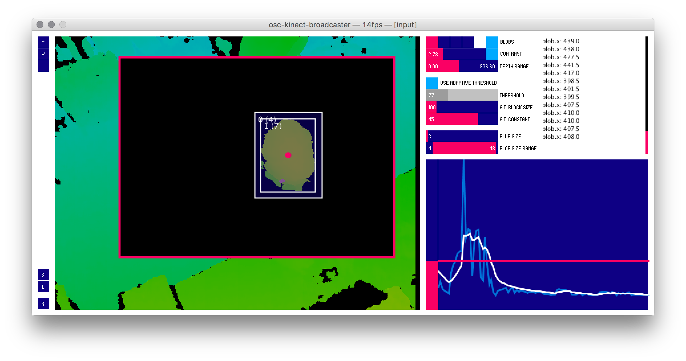

<h1 align="center">osc-kinect-broadcaster</h1>
<h3 align="center">kinect blob tracking</a> via OSC</h3>
<div align="center">
  <!-- License -->
  <a href="https://raw.githubusercontent.com/arnaudjuracek/xy/master/LICENSE">
    
  </a>
</div>

## Installation

Either build the sources from `sketch/` or download the latest [release](https://github.com/chevalvert/osc-kinect-broadcaster/releases).

## Configuration


## Usage

Launch the _.app_ then listen to the port `32000`. 
When a blob is tracked, an OSC message is sent on `/blob`, with the following data structure :

|position|datatype|description|
|:-:|---|---|
|0|`int`|blob ID
|1|`float`|x position of the blob
|2|`float`|y position of the blob
|3|`float`|width of the blob
|4|`float`|height of the blob

#### Example with Processing
```processing
import oscP5.*;
import netP5.*;

OscP5 oscP5;
NetAddress serverLocation;

void setup() {
  oscP5 = new OscP5(this, 32000);
  serverLocation = new NetAddress("127.0.0.1", 12000);
}

public void oscEvent(OscMessage message) {
  if (message.checkAddrPattern("/touch")) {
    if (message.checkTypetag("iffff")) {
      int id = message.get(0).intValue();
      float x = message.get(1).floatValue();
      float y = message.get(2).floatValue();
      float w = message.get(3).floatValue();
      float h = message.get(4).floatValue();

      println("new blob :");
      println("id :" + id);
      println("x  :" + x);
      println("y  :" + y);
      println("width  :" + w);
      println("height :" + h);
    }
  }
}
```

## Development
#### Requirements
###### Hardware
- Kinect v1 (v2 not tested)

###### Libraries
- [ControlP5](http://www.sojamo.de/libraries/controlP5/)
- [OpenCV for Processing](https://github.com/atduskgreg/opencv-processing)
- [Open Kinect for Processing](https://github.com/shiffman/OpenKinect-for-Processing)
- [Signal Filter](https://github.com/SableRaf/signalfilter)

#### Ressources

- [Persistence algorithm, Daniel Shifmann](http://shiffman.net/2011/04/26/opencv-matching-faces-over-time/)
- [OpenCV Image filtering, Jordi Tost](https://github.com/jorditost/ImageFiltering/tree/master/ImageFilteringWithBlobPersistence)

## License

[MIT](https://tldrlegal.com/license/mit-license).
